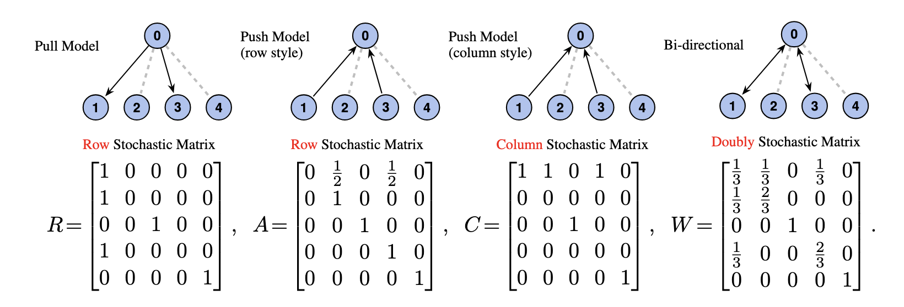
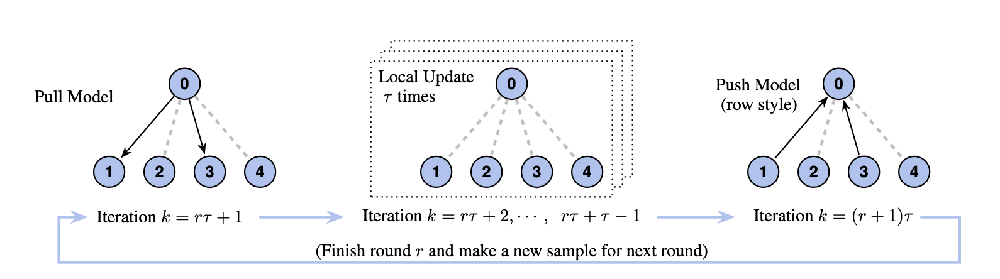
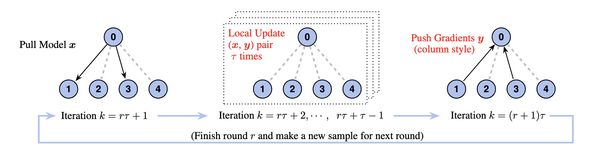

# Federated Optimization with exact Convergence via pUsh-pull Strategy (FOCUS) - NeurIPS'25
Arxiv Link: [https://arxiv.org/abs/2503.20117](https://arxiv.org/abs/2503.20117). 

In this work, we utilize graph theory and stochastic matrices to address two key challenges in Federated Learning (FL): arbitrary client participation and client drift, jointly. Our proposed algorithm, FOCUS, achieves exact convergence at a linear rate, irrespective of client participation patterns.

Several common communication pattern in FL can be described by the following graph and matrices.


With these graph language, FedAvg can be described by the following graph pattern.

Meanwhile, our proposed FOCUS follows a different pattern


Notably, FOCUS employs a column-stochastic matrix (for summation) instead of a row-stochastic one (for averaging) in the push step. This change is not a heuristic; rather, it is derived from the push-pull strategy. Once the Federated Learning task is formulated as a constrained optimization problem, a primal-dual method with push-pull matrices becomes a natural choice.


## Code
The implementation of `FOCUS`, along with several other common FL algorithms, is available in the `FedASL` directory (`FOCUS`'s former name). The remaining files in the repository provide utility functions for data loading, model management, and other supporting tasks. The core logic is implemented in `client.py` and `server.py`, while the entry point of the repository is `main.py` located in the root directory.


An example command for running experiment are
```bash
python main.py --seed=66 --iterations=10000 --dataset=cifar10 --method=fedasl --lr=2e-3 --dirichlet-alpha=0.05 --num-clients=32 --participation=bern;
```

The experiment figures in the paper are generated through `focus.ipynb` and `sg_focus.ipynb` under figures folder.

## Citation

```
@inproceedings{
  Ying2025exact,
  title={Exact and Linear Convergence for Federated Learning under Arbitrary Client Participation is Attainable},
  author={Bicheng Ying and Zhe Li and Haibo Yang},
  booktitle={The Thirty-ninth Annual Conference on Neural Information Processing Systems},
  year={2025},
  url={https://openreview.net/forum?id=TeocEZCWnr}
}
```
